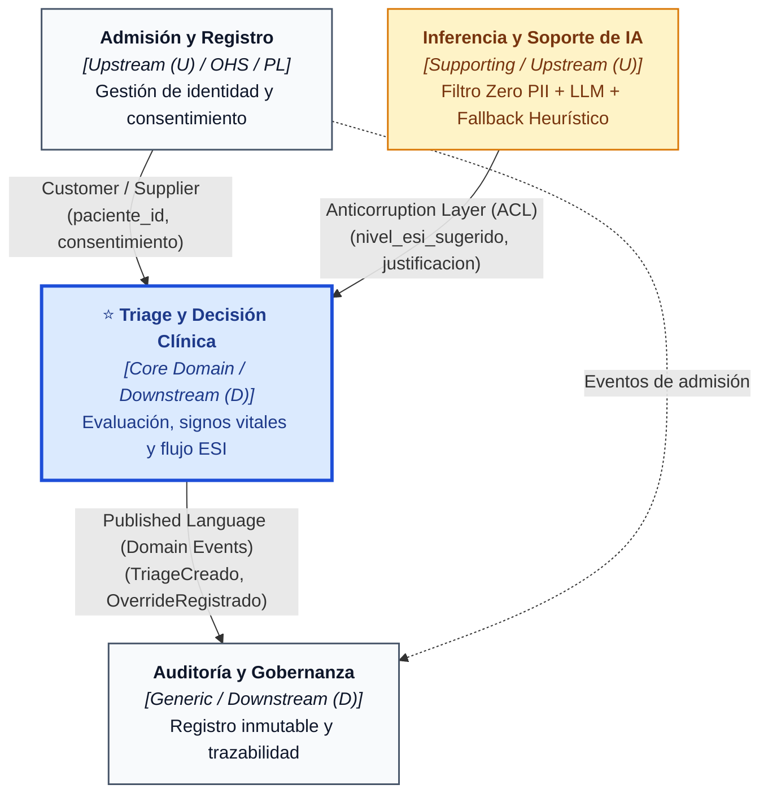

# Delimitación de Contextos (Bounded Contexts) y Context Map — MediTriage

Este documento define la arquitectura de dominios de **MediTriage** aplicando los principios de *Domain-Driven Design* (DDD). En él se establecen las fronteras explícitas, el lenguaje ubicuo de cada área, las responsabilidades sistémicas, la decisión arquitectónica sobre el componente de Inteligencia Artificial y el mapa de relaciones (*Context Map*).

---

## 1. Identificación de Bounded Contexts

El sistema MediTriage se estructura en **cuatro Bounded Contexts**, separando las responsabilidades administrativas, clínicas, analíticas y médico-legales.

```
+-----------------------------------------------------------------------------------+
|                                     MEDITRIAGE                                    |
+--------------------------+------------------------------+-------------------------+
|    GENERIC SUBDOMAIN     |         CORE DOMAIN          |    SUPPORTING DOMAIN    |
|   Admisión y Registro    |  Triage y Decisión Clínica   |  Inferencia y Soporte   |
|       de Pacientes       |   (Contexto Principal DER)   |          de IA          |
+--------------------------+------------------------------+-------------------------+
|                                  GENERIC SUBDOMAIN                                |
|                        Auditoría y Gobernanza Médico-Legal                        |
+-----------------------------------------------------------------------------------+
```

---

### 1.1. Contexto de Admisión y Registro de Pacientes (*Patient Intake & Admission Context*)
* **Tipo de Subdominio:** Genérico (*Generic Subdomain*).
* **Responsabilidad:** Gestionar la identificación civil del paciente, sus datos demográficos básicos, antecedentes de contacto, contactos de emergencia y el otorgamiento del consentimiento informado al ingresar al centro de salud.
* **Términos propios (Lenguaje Ubicuo):**
  * *Paciente:* Sujeto de derecho con identidad legal verificable.
  * *RUT / Identificador Civil:* Documento único nacional cifrado para protección de datos personales (PII).
  * *Ficha de Admisión:* Registro administrativo de entrada al establecimiento.
  * *Contacto de Emergencia:* Tercero responsable o tutor asignado.
  * *Consentimiento Informado:* Autorización legalmente válida para tratamiento de datos y evaluación clínica.
* **Por qué es un contexto separado:** Su propósito es administrativo, civil y legal. Un paciente existe en este contexto con independencia de si requiere atención médica inmediata o no. Sus modelos no requieren conocer constantes fisiológicas, puntajes de gravedad ni clasificaciones de urgencia.

---

### 1.2. Contexto de Triage y Decisión Clínica (*Clinical Triage Context*) — ⭐ CORE DOMAIN
* **Tipo de Subdominio:** Principal (*Core Domain*).
* **Responsabilidad:** Coordinar el flujo completo de evaluación de urgencia: captura de signos vitales, sintomatología, determinación de la prioridad vital mediante la escala ESI (*Emergency Severity Index*, 1 al 5), asignación y gestión de la sala de espera, y registro de la decisión médica final, incluyendo la sobrescritura (*override*) fundamentada.
* **Términos propios (Lenguaje Ubicuo):**
  * *Episodio de Triage:* Evento clínico temporal acotado que inicia con la evaluación y culmina con el ingreso a box o el alta.
  * *Nivel ESI (1 al 5):* Índice de severidad de emergencia estandarizado (1: Reanimación inmediata, 5: No urgente).
  * *Signos Vitales:* Constantes fisiológicas objetivas (Presión arterial sistólica/diastólica, FC, FR, SpO2, Temperatura).
  * *Escala de Dolor:* Evaluación subjetiva del dolor (0 al 10).
  * *Estado del Paciente:* Etapa dentro del flujo de urgencia (`en_espera`, `en_atencion`, `cerrado`).
  * *Decisión Clínica:* Criterio final vinculante emitido por el profesional de salud responsable.
  * *Sobrescritura Médica (Override):* Acto clínico explícito donde el facultativo modifica el ESI sugerido por la IA, exigiendo obligatoriamente una justificación técnica.
* **Por qué es un contexto separado:** Es la razón de existir del producto y donde reside el valor diferencial: optimizar tiempos de espera y clasificar con precisión para salvar vidas. Sus invariantes de negocio están sujetas a alta presión temporal y normativas sanitarias estrictas.

> **Definición del Contexto Principal para el DER:**  
> **Triage y Decisión Clínica es el Contexto Principal.** Es el núcleo modelado en el Diagrama Entidad-Relación (DER) transaccional (`episodio_triage`, `signos_vitales`, `sintomas`, `decision_clinica`). Las demás entidades orbitan alrededor de este núcleo como datos maestros de entrada o registros derivados de gobernanza.

---

### 1.3. Contexto de Inferencia y Soporte de IA (*AI Decision Support & Fallback Context*)
* **Tipo de Subdominio:** Soporte (*Supporting Domain*).
* **Responsabilidad:** Recibir vectores de datos clínicos anonimizados (libres de PII), ejecutar el motor de inferencia (LLM / modelo de Machine Learning) para sugerir un nivel ESI con su justificación estructurada, y conmutar de manera transparente hacia un árbol de reglas heurísticas deterministas en caso de fallo o latencia excesiva.
* **Términos propios (Lenguaje Ubicuo):**
  * *Filtro Zero PII (Sanitizador):* Mecanismo de inspección que garantiza la ausencia total de nombres, RUT, direcciones o datos identificables antes de la inferencia.
  * *Token de Correlación Efímero:* Identificador volátil utilizado exclusivamente para correlacionar la consulta con la respuesta sin almacenar trazabilidad del paciente.
  * *Nivel ESI Sugerido:* Predicción algorítmica probabilística (1 a 5).
  * *Justificación de IA:* Resumen argumentativo emitido por el modelo en lenguaje clínico estandarizado.
  * *Reglas Heurísticas de Respaldo (Fallback):* Lógica determinista de contingencia basada en umbrales fisiológicos críticos.
  * *Hash de Entrada:* Huella criptográfica no reversible de los parámetros enviados para verificación de integridad.
* **Por qué es un contexto separado:** Su naturaleza técnica es computacional y algorítmica. La IA no posee atribución médica legal; opera como un asesor desacoplado cuyo ciclo de vida técnico (modelos, hiperparámetros, prompts, proveedores cloud o locales) evoluciona con independencia de las reglas clínicas del hospital.

---

### 1.4. Contexto de Auditoría y Gobernanza Médico-Legal (*Audit & Governance Context*)
* **Tipo de Subdominio:** Genérico (*Generic Subdomain*).
* **Responsabilidad:** Capturar una bitácora inmutable de eventos clínicos relevantes, cambios de estado de pacientes y, especialmente, discrepancias entre el criterio del modelo de IA y la decisión final humana, garantizando la cadena de custodia probatoria.
* **Términos propios (Lenguaje Ubicuo):**
  * *Registro de Auditoría (Audit Log):* Entrada inmutable y fechada con sello de tiempo UTC.
  * *Discrepancia Humano-IA:* Evento en el cual el ESI final difiere del ESI sugerido algorítmicamente.
  * *Hash Anterior / Hash Actual:* Encadenamiento criptográfico para verificar la no alteración del historial.
  * *Rol Auditor:* Perfil de usuario con permisos de lectura forense sobre el historial.
* **Por qué es un contexto separado:** Maneja requerimientos no funcionales de inmutabilidad (*append-only*), respaldo legal y cumplimiento normativo. Sus consultas son asíncronas y analíticas; no deben penalizar el rendimiento transaccional de la sala de urgencias.

---

## 2. Decisión Arquitectónica: Clasificación con IA como Contexto Propio

### Decisión
Se determina que el componente de clasificación con IA —incluyendo el **filtro Zero PII** y el **mecanismo de reglas heurísticas de respaldo**— constituye un **Bounded Context Propio (Supporting Domain)** y **NO** forma parte interna del contexto de Triage.

### Justificación

1. **Perímetro de Privacidad y Frontera de Confianza (Zero PII):**  
   El contexto de Triage gestiona internamente la identidad y ficha del paciente para la atención médica. El motor de inferencia debe operar bajo una política de "cero conocimiento" (*Zero Knowledge / Zero PII*). Colocar el filtro Zero PII como frontera de entrada a este contexto garantiza que **ningún dato personal identificable cruce jamás hacia el proveedor de IA (LLM)**. El límite del contexto actúa como límite físico de seguridad.

2. **Resiliencia y Concurrencia Crítica (Fallback Heurístico):**  
   En un servicio de urgencias, el sistema no puede detenerse si el modelo de lenguaje sufre degradación de red, agotamiento de cuota o indisponibilidad del proveedor. Agrupar la IA y las reglas heurísticas dentro del mismo contexto permite aplicar patrones de resiliencia como **Circuit Breaker**: si la IA no responde en menos de 1.500 ms, el subsistema heurístico devuelve inmediatamente la clasificación basada en árboles de decisión clínicos. Para el contexto de Triage, la interfaz de respuesta es idéntica y transparente.

3. **Pureza del Lenguaje Ubicuo y Modelo Conceptual:**  
   En Triage, los conceptos clave son asistenciales (*cama, box, escala visual analógica, médico de turno*). En el motor de inferencia, los conceptos son de ingeniería de software y machine learning (*temperatura del prompt, tokens consumidos, embeddings, latencia p99, fallback determinista*). Mezclar ambas visiones en una misma entidad o módulo generaría un modelo anémico y altamente acoplado.

4. **Evolución Tecnológica y Desacoplamiento de Proveedores:**  
   Este diseño permite reemplazar el motor de inferencia (por ejemplo, migrar de un LLM en la nube a un modelo local tipo LLaMA/Mistral cuantizado para salud) o actualizar los árboles de decisión heurísticos sin modificar la base de datos de triage, las pantallas de los médicos ni los contratos de negocio.

---

## 3. Context Map (Mapa de Contextos)

### 3.1. Diagrama de Relaciones

```
+---------------------------------------------------------------------------------+
|                                   CONTEXT MAP                                   |
+---------------------------------------------------------------------------------+

                      +----------------------------------+
                      |       Admisión y Registro        |
                      |   [ Upstream (U) / OHS - PL ]    |
                      +-----------------+----------------+
                                        |
                                        | Datos demográficos mínimos
                                        | y estado de consentimiento
                                        | [ Customer / Supplier ]
                                        v
+------------------------+    +--------------------------+    +-------------------+
|  Inferencia y Soporte  |    | ⭐ CONTEXTO PRINCIPAL:    |    |    Auditoría y    |
|         de IA          |    |  Triage y Decisión (D)   |    |    Gobernanza     |
|     [ Upstream (U) ]   |    +------------+-------------+    |  [ Downstream (D) |
+-----------+------------+                 |                  |   / Conformist ]  |
            |                              |                  +---------+---------+
            | Predicción ESI y             | Eventos clínicos           ^
            | justificación estructurada   | inmutables y overrides     |
            | [ ACL ]                      +----------------------------+
            v                              |  [ Published Language ]
    (Capa Anticorrupción)                  |
```

### 3.2. Representación en Mermaid



---

## 4. Matriz de Relaciones entre Contextos

| Upstream (U) | Downstream (D) | Patrón de Integración | Contrato / Mecanismo de Comunicación | Justificación Arquitectónica |
| :--- | :--- | :--- | :--- | :--- |
| **Admisión y Registro** | **Triage y Decisión** | **Customer / Supplier** con **Open Host Service (OHS)** | API REST interna (`GET /patients/{id}`), formato JSON estable (*Published Language*). | Triage actúa como cliente de Admisión. Triage requiere la existencia previa de un `paciente_id` válido para iniciar la atención, pero no manipula los datos de contacto o familiares directamente. |
| **Inferencia y Soporte de IA** | **Triage y Decisión** | **Anticorruption Layer (ACL)** | Contrato DTO unificado (`ClasificacionIAResponse`: `esi_sugerido`, `justificacion`, `modelo_usado`, `tiempo_ms`). | Triage **no debe acoplarse** a la API de ningún proveedor de IA (Google, OpenAI o local). El ACL traduce la respuesta algorítmica al modelo de dominio de Triage e independiza la lógica de fallback. |
| **Triage y Decisión** | **Auditoría y Gobernanza** | **Published Language** con **Conformist** | Eventos de dominio serializados en `JSONB` (`TriageRegistradoEvent`, `OverrideEjecutadoEvent`). | Auditoría se adapta íntegramente a los eventos emitidos por el Core Domain. Auditoría no influye en las decisiones clínicas; su único rol es registrar de forma fiel e inmutable los hechos ocurridos. |

---

## 5. Mapeo al Modelo de Datos Físico (PostgreSQL / Neon)

Para garantizar la independencia definida en el Context Map, la base de datos refleja la separación lógica mediante segregación de tablas y claves foráneas bien delimitadas:

* **Tablas de Admisión:** `paciente`, `contacto_paciente`, `contacto_emergencia`, `consentimiento`.
* **Tablas del Core Domain (Triage):** `episodio_triage`, `signos_vitales`, `sintomas`, `decision_clinica`.
* **Tablas de Inferencia (Soporte IA):** `clasificacion_ia` (registra el token efímero, hashes y latencias sin datos identificatorios).
* **Tablas de Auditoría:** `registro_auditoria` (estructura *append-only* con encadenamiento criptográfico `hash_anterior` / `hash_actual`).